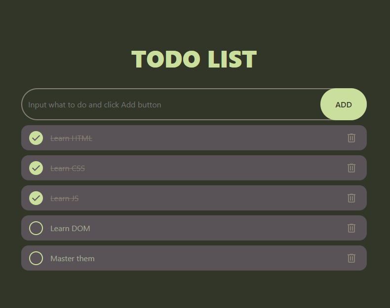

# 📝 Todo List App

A simple and responsive Todo List web application built with HTML, CSS, and JavaScript.

## 🚀 Features

- Add new tasks
- Mark tasks as completed
- Delete tasks
- Automatically save tasks using Local Storage
- Responsive design for mobile and desktop
- Clean and modern UI

## 🛠️ Technologies Used

- HTML5
- CSS3
- JavaScript (Vanilla JS)
- Local Storage API

## 📂 Project Structure

```
TodoList/
├── images/
│   └── preview.png
├── index.html
├── style.css
├── script.js
├── README.md
└── LICENSE
```

## 📸 Preview




## ⚙️ How to Run

1. Clone the repository

```
git clone https://github.com/LemonKing-sleepy/TodoList.git
```

2. Open the project folder.

3. Open `index.html` in your browser or use **Live Server** in VS Code.

## 💡 How It Works

- Type a task into the input field.
- Click the **Add** button.
- Click the checkbox to mark a task as completed.
- Click the delete icon to remove a task.
- All tasks are automatically saved in your browser's Local Storage.

## 🌟 Future Improvements

- Edit existing tasks
- Task categories
- Due dates
- Dark/Light mode toggle
- Drag and drop task ordering
- Search and filter tasks

## 📄 License

This project is open-source and available under the MIT License.

---

Made with ❤️ using HTML, CSS, and JavaScript.
